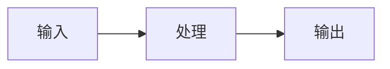

# 课程笔记整理

将课程文档或视频转写稿，整理成结构化 Markdown 课程笔记，自动存入 Obsidian vault。

**Obsidian vault 根目录**：`/Users/zhaojiaqi/Documents/Obsidian/`

---

## 第一步：提取文档内容

根据文件类型选择提取方式：

**`.docx` 文件：**
```bash
SKILL_DIR="/Users/zhaojiaqi/Library/Application Support/Claude/local-agent-mode-sessions/skills-plugin/a6306332-4710-43be-8a97-bff4bc136cd5/7f25a16b-12e7-4560-bc09-3f7691281baa/skills/docx"
python3 "$SKILL_DIR/scripts/office/unpack.py" "文件路径" /tmp/doc_unpacked/
```
然后用 python3 + xml.etree.ElementTree 从 `/tmp/doc_unpacked/word/document.xml` 提取全文文本。

**直接粘贴的文字稿**：跳过提取，直接进入第二步。

---

## 第二步：分析内容结构

通读全文，识别：
- 核心章节和层级（对应 Markdown `##` / `###`）
- **流程、步骤、因果关系** → 用 Mermaid flowchart/sequenceDiagram
- **对比、汇总信息** → 用 Markdown 表格
- **概念关系网络** → 用 Mermaid graph 或 mindmap
- 关键结论和要点

---

## 第三步：撰写课程笔记

输出格式要求：

### 整体结构
```
# 课程标题 · 第X课笔记
> 课程名称 / 本节主题

---
## 目录（列出各章节）
---
## 一、...
## 二、...
## 三、...
---
## 本课总结
```

### Mermaid 使用原则
- **流程 / 步骤 / 原理** → `flowchart TD` 或 `flowchart LR`
- **时序 / 交互** → `sequenceDiagram`
- **概念网络** → `graph TD`
- **知识全景** → `mindmap`
- 每个 Mermaid 图要有实质内容，不要为了加图而加图

示例：
````

````

### 表格使用原则
- 两个及以上概念做对比时，用表格
- 属性/维度/特征的汇总，用表格
- 表格要有表头，列名清晰

### 内容要求
- 保留原课的核心概念和逻辑，**不丢知识点**
- 语言精炼，去掉口语化的废话和重复
- 关键术语加粗
- 类比和举例保留，帮助理解

---

## 第四步：判断保存路径，存入 Obsidian

查看 Obsidian 现有文件夹结构：
```bash
ls /Users/zhaojiaqi/Documents/Obsidian/
ls /Users/zhaojiaqi/Documents/Obsidian/02-学习/
ls /Users/zhaojiaqi/Documents/Obsidian/02-学习/AI技术/
```

根据笔记主题，选择最合适的已有目录。如果没有合适的，可以新建文件夹（用户已授权）。

**典型路径参考：**

| 内容类型 | 路径示例 |
|---------|---------|
| 大模型 / AI 基础 | `02-学习/AI技术/大模型基础/` |
| Agent / 工作流 | `02-学习/AI技术/Agent与工作流/` |
| Prompt 工程 | `02-学习/AI技术/Prompt工程/` |
| 产品 / 商业 | `02-学习/产品商业/` |
| 全栈开发 | `02-学习/全栈开发/` |
| 不确定归属 | `00-收件箱/` |

**文件命名**：`{课程名}_{第X课}笔记.md`，例如 `大模型基础原理_第一课笔记.md`

保存后告诉用户完整路径，方便他在 Obsidian 里找到。
